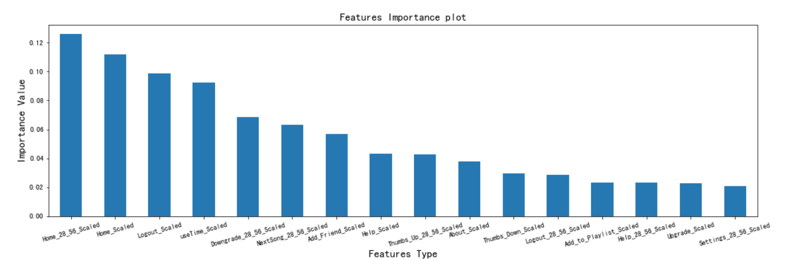

# Spark预测用户流失项目

## 目录结构
```text
├── README.md
├── Report.md
├── Spark_Predict_user_churn.ipynb
├── mini_sparkify_event_data.json
└── images
```
* mini_sparkify_event_data.json 用户行为日志文件
* Spark_Predict_user_churn.ipynb 主文件，包含分析、建模代码
* README.md 当前文件
* Report.md 总结报告文件

## 依赖库

* 可视化库：matplotlib, seaborn
* 数据处理库：numpy, pandas, pyspark

## 项目目的

针对音乐类服务的用户行为数据，预测哪些用户可能流失、哪些用户会降级服务(从付费到免费)，或者这取消服务。
如果能预测出这些用户，通过打折已激励的方式留住他们，以挽救数百万的营业额。


## 项目总结

完成项目的流程：

```text
数据清理 --> 数据处理及分析 --> 特征工程 --> 建模分析
```

使用pyspark完成上述流程，练习、巩固了spark数据处理方面的技能。
针对本项目，发现的特征重要性如下：




* 详细报告见 [Report.md](./Report.md)

