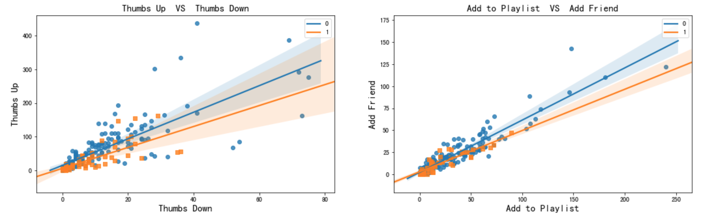
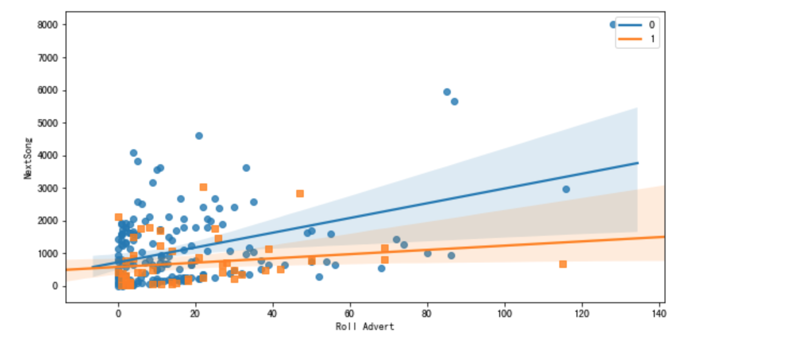
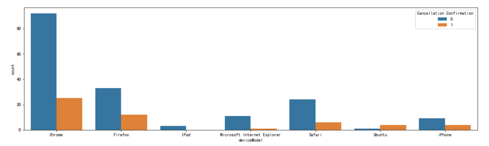
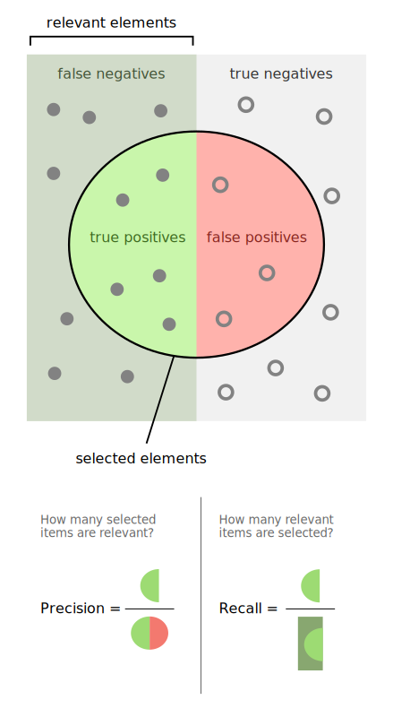
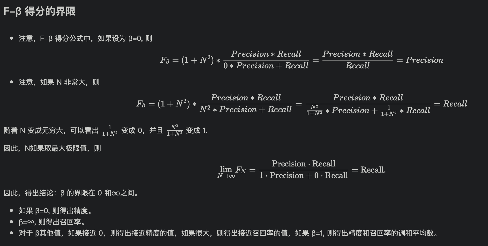
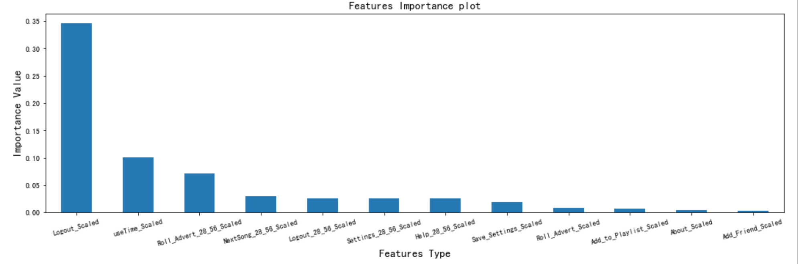

# 项目简介

## 背景

当前万物互联的时代，每天都会产生大量的数据，尤其对于互联网公司，大量的用户群产生海量的用户行为数据，分析这些行为数据不但能改善优化产品，
增加用户的粘性，更能给企业带来大量的利润。

此项目，针对音乐类服务的用户行为数据，预测哪些用户可能流失、哪些用户会降级服务(从付费到免费)，或者这取消服务。如果能预测出这些用户，
通过打折已激励的方式留住他们，便可挽救数百万的营业额。


## 项目工作流程

针对原始数据集，完成数据的清理和探索。
汇总数据，进而完成特征工程，分离出特征和标签
最后使用Spark MLlib完成机器学习建模，达到可预测用户是否流失的目的


## 数据探索

Total rows: 286500

```text
+------+----+---------+------+-------------+--------+------+-----+--------+------+----+------------+---------+-----+------+---+---------+------+
|artist|auth|firstName|gender|itemInSession|lastName|length|level|location|method|page|registration|sessionId| song|status| ts|userAgent|userId|
+------+----+---------+------+-------------+--------+------+-----+--------+------+----+------------+---------+-----+------+---+---------+------+
| 58392|   0|     8346|  8346|            0|    8346| 58392|    0|    8346|     0|   0|        8346|        0|58392|     0|  0|     8346|     0|
+------+----+---------+------+-------------+--------+------+-----+--------+------+----+------------+---------+-----+------+---+---------+------+

root
 |-- artist         string   
 |-- song           string   
 |-- auth           string   
 |-- firstName      string  
 |-- gender         string  
 |-- itemInSession  long  
 |-- lastName       string  
 |-- length         double  
 |-- level          string  
 |-- location       string  
 |-- method         string  
 |-- page           string  
 |-- registration   long  
 |-- sessionId      long  
 |-- status         long  
 |-- ts             long  
 |-- userAgent      string  
 |-- userId         string  
```


## 数据清理

1. 统计每个列null统计
    * (firstName, lastName, location, registration, userAgent) null值都是 8346行，对应的page为：Logout 、Submit Registration、Login、Register，所以可以删除这些行
2. 删除2列: artist、song
    * 列artist、song列空值58392个，这是正常情况，因为用户浏览Home/About等列没有歌曲名和歌曲作者，这两行不参与建模

## 数据处理
1. timestamp列格式转换
    * 涉及特征列：ts, registration
2. 用户注册时长统计(单位：天)
3. 根据userAgent列生成 设备信息列 
    * 值为：(设备、浏览器、系统类型)

## 数据探索
1. 探索数据
    1. 探索如下特征对用户是否取消服务的影响
        * 用户点赞、踩
        * 添加好友
        * 添加歌曲
        * 听歌频率
        * 设置功能
        * 使用设备
        * 注册时长
        * 升级、降级
        * 访问Home、About、Help次数
        * Error次数
        * 查看滚动广告的次数
2. 结论
    * 使用Setting多的用户，越不容易取消服务, 说明用户乐于使用产品
    * 使用Ubuntu取消服务偏多、iPad使用人取消服务人相对较少
    * 取消服务的人明显听歌数量也偏少
    * 查看滚动广告越多的，越容易取消服务
    * 越少的降级发生越好
    * 点赞越少的用户，越倾向于取消服务
    * 添加好友和添加歌曲少于20的用户，越可能取消服务
    * 添加好友次数越少的用户，越倾向于取消服务
    
### 可视化举例
#### 点赞、踩、添加好友、添加歌曲 对是否取消服务的影响

* 'Thumbs Down' VS 'Thumbs Up' 
* 'Add Friend' VS 'Add to Playlist'



#### 听歌的频率、查看滚动广告 对是否取消服务的影响

* NextSong
* Roll Advert



#### 使用设备

* deviceModel



## 特征工程

* 按用户分组汇总用户访问page页行为
* 寻找流失用户做多的时间段，统计这个时间段内用户访问page页的行为
* 流失最多时间段用户访问page页行为 相对于用户访问page页总量占比
* 联合特殊，并归一化数据集

### 最终特征概览

* *_Scaled 中 '*'表示 用户访问page页类型
* *_Scaled 代表归一化后的特征
* *_28_56_Pct 代表 子集行为对总行为占比

```text
root
 |-- userId: string (nullable = true)
 |-- About_Scaled: double (nullable = true)
 |-- Add_Friend_Scaled: double (nullable = true)
 |-- Add_to_Playlist_Scaled: double (nullable = true)
 |-- Downgrade_Scaled: double (nullable = true)
 |-- Error_Scaled: double (nullable = true)
 |-- Help_Scaled: double (nullable = true)
 |-- Home_Scaled: double (nullable = true)
 |-- Logout_Scaled: double (nullable = true)
 |-- NextSong_Scaled: double (nullable = true)
 |-- Roll_Advert_Scaled: double (nullable = true)
 |-- Save_Settings_Scaled: double (nullable = true)
 |-- Settings_Scaled: double (nullable = true)
 |-- Submit_Downgrade_Scaled: double (nullable = true)
 |-- Submit_Upgrade_Scaled: double (nullable = true)
 |-- Thumbs_Down_Scaled: double (nullable = true)
 |-- Thumbs_Up_Scaled: double (nullable = true)
 |-- Upgrade_Scaled: double (nullable = true)
 |-- About_28_56_Scaled: double (nullable = true)
 |-- Add_Friend_28_56_Scaled: double (nullable = true)
 |-- Add_to_Playlist_28_56_Scaled: double (nullable = true)
 |-- Downgrade_28_56_Scaled: double (nullable = true)
 |-- Error_28_56_Scaled: double (nullable = true)
 |-- Help_28_56_Scaled: double (nullable = true)
 |-- Home_28_56_Scaled: double (nullable = true)
 |-- Logout_28_56_Scaled: double (nullable = true)
 |-- NextSong_28_56_Scaled: double (nullable = true)
 |-- Roll_Advert_28_56_Scaled: double (nullable = true)
 |-- Save_Settings_28_56_Scaled: double (nullable = true)
 |-- Settings_28_56_Scaled: double (nullable = true)
 |-- Submit_Downgrade_28_56_Scaled: double (nullable = true)
 |-- Submit_Upgrade_28_56_Scaled: double (nullable = true)
 |-- Thumbs_Down_28_56_Scaled: double (nullable = true)
 |-- Thumbs_Up_28_56_Scaled: double (nullable = true)
 |-- Upgrade_28_56_Scaled: double (nullable = true)
 |-- useTime_Scaled: double (nullable = true)
 |-- About_28_56_Pct: double (nullable = true)
 |-- Add_Friend_28_56_Pct: double (nullable = true)
 |-- Add_to_Playlist_28_56_Pct: double (nullable = true)
 |-- Downgrade_28_56_Pct: double (nullable = true)
 |-- Error_28_56_Pct: double (nullable = true)
 |-- Help_28_56_Pct: double (nullable = true)
 |-- Home_28_56_Pct: double (nullable = true)
 |-- Logout_28_56_Pct: double (nullable = true)
 |-- NextSong_28_56_Pct: double (nullable = true)
 |-- Roll_Advert_28_56_Pct: double (nullable = true)
 |-- Save_Settings_28_56_Pct: double (nullable = true)
 |-- Settings_28_56_Pct: double (nullable = true)
 |-- Submit_Downgrade_28_56_Pct: double (nullable = true)
 |-- Submit_Upgrade_28_56_Pct: double (nullable = true)
 |-- Thumbs_Down_28_56_Pct: double (nullable = true)
 |-- Thumbs_Up_28_56_Pct: double (nullable = true)
 |-- Upgrade_28_56_Pct: double (nullable = true)
 |-- locationVec: vector (nullable = true)
 |-- deviceModelVec: vector (nullable = true)
 |-- label: long (nullable = true)
 |-- features: vector (nullable = true)
```

### 标签

用户流失指标定义

事件：Cancellation Confirmation 定义为用户流失(用户取消服务)事件，也是本次预测的label值, 1 代表取消服务，0 代表为取消服务。


## Spark MLlib库进行机器学习建模 

### 模型评估指标

* 准确率（混淆矩阵所有数据中，我们正确的分类有多少？）


* F1-Score (精准率和召回率的调和均值)






### 模型选择及训练

* 模型选择 GBTClassifier

适合二分类任务

#### 参数调优

使用pyspark网格搜索、交叉验证进行参数调优

| 参数 | 取值 | 参数含义 |
| :-----| :---- | :----|
| stepSize | [0.1, 0.01, 0.001] | learning rate |
| maxIter | [20] | iter times |
| maxDepth   | [5] | tree depth |

```python
# 参数调优
# Train a GBT model.
gbt = GBTClassifier(labelCol="indexedLabel", featuresCol="indexedFeatures", maxIter=20, stepSize=0.01)

# Chain indexers and GBT in a Pipeline
pipeline = Pipeline(stages=[labelIndexer, featureIndexer, gbt])

paramGrid= ParamGridBuilder() \
    .addGrid(gbt.stepSize, [0.1, 0.01, 0.001]) \
    .addGrid(gbt.maxIter, [20]) \
    .addGrid(gbt.maxDepth, [5]) \
    .build()

corssval = CrossValidator(estimator=pipeline,
                         estimatorParamMaps=paramGrid,
                         evaluator=MulticlassClassificationEvaluator(),
                         numFolds=3)
```

**最优参数**
* stepSize = 0.01
```python
model.getEstimatorParamMaps()[ np.argmax(model.avgMetrics) ]
{Param(parent='GBTClassifier_25a651802674', name='stepSize', doc='Step size (a.k.a. learning rate) in interval (0, 1] for shrinking the contribution of each estimator.'): 0.01,
 Param(parent='GBTClassifier_25a651802674', name='maxIter', doc='max number of iterations (>= 0).'): 20,
 Param(parent='GBTClassifier_25a651802674', name='maxDepth', doc='Maximum depth of the tree. (>= 0) E.g., depth 0 means 1 leaf node; depth 1 means 1 internal node + 2 leaf nodes.'): 5}
```


#### 模型评估值得分


| 评估指标 | 最终得分 | 
| :-----:| :----: | 
| Accuracy | 0.8260869565217391 | 
| F1-Score | 0.8072463768115942 | 

评估指标得分不提理想，原因数据样本较少，如果我们可以基于相对较大的数据集训练分类器，结果可能会更好些。

#### 特征重要性对比图




可以看到，用户访问Logout、注册时长、查看滚动广告次数 、听歌数量、经常访问Help页、频繁setting 特征对于用户是否取消服务影响比较大


## 结论

应该进一步研究用户为什么频繁Logout的行为，以了解新用户或普通用户是否会流失。

* 当常规用户频繁的访问Logout，可能在听歌的页面亮点太少，或者没有想要的功能，让用户感到失望。
* 注册长、添加好友导致用户流失，原因可能是内容没有足够频繁地更新，也可能用户量少，互动内容少，导致用户流失。
* 当新注册的用户倾向于流失时。原因可能是乍一看内容不够吸引人。
* 广告的质量太低，容易引起反感，也会导致用户流失
* 经常访问Help页，可能因为功能的易用性不足
* 频繁使用setting功能，可能因为初始设置不合理
* 收集更多数据
* 研究多种机器学习算法，以获得更准确的结果


## 反思

完成项目的流程：

```text
数据清理 --> 数据处理及分析 --> 特征工程 --> 建模分析
```
* 数据清理阶段，主要对数据Null值情况分析、无用特征清理
* 数据处理分析阶段，只要对特征类型、比如时间类型。数据可视化，分析特征之间的关系；新特征的创建。
* 特征工程，特征的归一化，特征向量的生成
* 模型选择、评估指标的定义、最后得出特征重要性得分，并可视化

## 改进

* 搜集更多的数据，进一步分析
* 尝试多种机器学习算法，已获得更合适、更准确的结果


## 参考

* [Spark GBTClassifier 文档](https://spark.apache.org/docs/2.2.0/ml-classification-regression.html)
* [Spark DataFrame 文档](https://dzone.com/articles/pyspark-dataframe-tutorial-introduction-to-datafra)
* [维基百科-F1_Score](https://en.wikipedia.org/wiki/F1_score)
